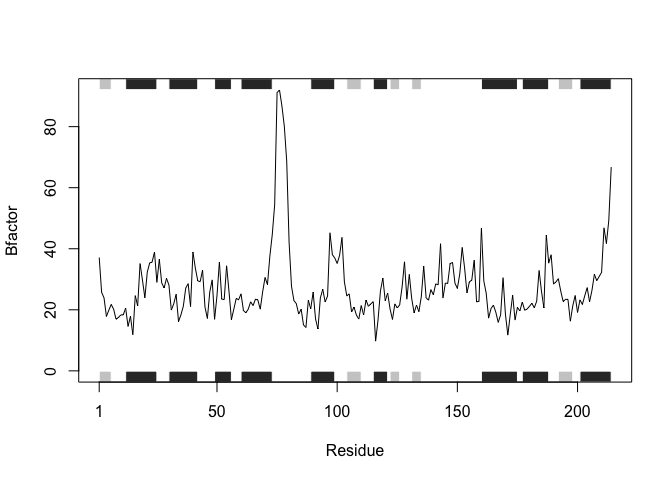
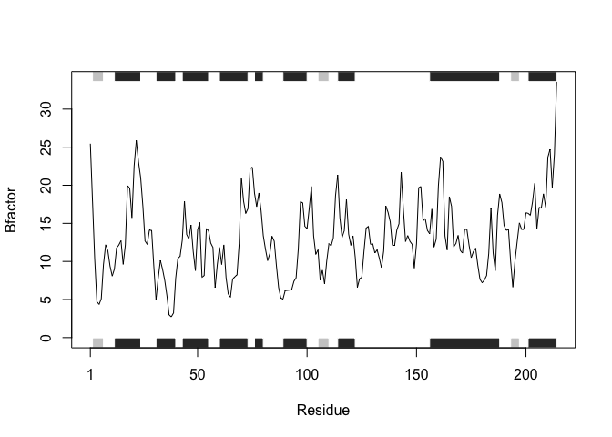

GiuliaLivrizziHomework
================
Giulia
10/18/2019

\#WORKING ON QUESTION 6 FOR HOMEWORK

``` r
library(bio3d)
```

``` r
#this will be my input that I will apply:
#pdbid <- "4AKE" (I can change this depending on the kinase)
#This function will make possible to visualize B factor trends for different proteins. 
myfun <- function(pdbid, chain="A") {
  s1 <- read.pdb(pdbid) # pdbid of any protein of interest; chain A is already defined
  s1.chainA <- trim.pdb(s1, chain=chain, elety="CA")
  s1.b <- s1.chainA$atom$b #defining atoms
  plotb3(s1.b, sse=s1.chainA, typ="l", ylab="Bfactor") #plotting the results.
}
```

``` r
myfun("1AKE") #testing if the function works again with another kinase name
```

    ##   Note: Accessing on-line PDB file
    ##    PDB has ALT records, taking A only, rm.alt=TRUE

<!-- -->

\#Down here working on the other questions in class (not for homework):

``` r
library(bio3d)
s1 <- read.pdb("4AKE") # kinase with drug
```

    ##   Note: Accessing on-line PDB file

``` r
s2 <- read.pdb("1AKE") # kinase no drug
```

    ##   Note: Accessing on-line PDB file

    ## Warning in get.pdb(file, path = tempdir(), verbose = FALSE): /var/folders/
    ## _k/v21rlknn3qv_wrp49ym25knm0000gn/T//Rtmp7s03jF/1AKE.pdb exists. Skipping
    ## download

    ##    PDB has ALT records, taking A only, rm.alt=TRUE

``` r
s3 <- read.pdb("1E4Y") # kinase with drug
```

    ##   Note: Accessing on-line PDB file

``` r
s1.chainA <- trim.pdb(s1, chain="A", elety="CA")
s2.chainA <- trim.pdb(s2, chain="A", elety="CA")
s3.chainA <- trim.pdb(s3, chain="A", elety="CA")
s1.b <- s1.chainA$atom$b
s2.b <- s2.chainA$atom$b
s3.b <- s3.chainA$atom$b
plotb3(s1.b, sse=s1.chainA, typ="l", ylab="Bfactor")
```

<!-- -->

``` r
plotb3(s2.b, sse=s2.chainA, typ="l", ylab="Bfactor")
```

<!-- -->

``` r
plotb3(s3.b, sse=s3.chainA, typ="l", ylab="Bfactor")
```

<!-- -->
\#Q1:when we run read.pdb(nameofprotein) it searches online for the PDB
file and it imports the data \#Q2: when we use trim.pdb,we can obtain a
smaller subset of atoms from the large protein. In the argument you have
to specify the chains and the targeted atoms and specify the element
type(elety=CA). \#Q3:Troubloshooting:removing the black and grey
boxes….but what are they?secondary structures forms. \#Q4:put them on
the same graph plotb3(s1.b, sse=s1.chainA, typ=“l”, ylab=“Bfactor”)
points(s3.b, typ=“l”, col=“blue”) points(s2.b, typ=“l”, col=“red”) \#Q5.
Which proteins are more similar to each other in their B-factor trends.
How could you quantify this? I corrected the mistake in the code to have
s1,s2,s3 and so the more similar ones will be 1AKE and 1E4Y. \#create a
function that plot them to quantify: hc \<- hclust( dist( rbind(s1.b,
s2.b, s3.b) ) ) plot(hc)
