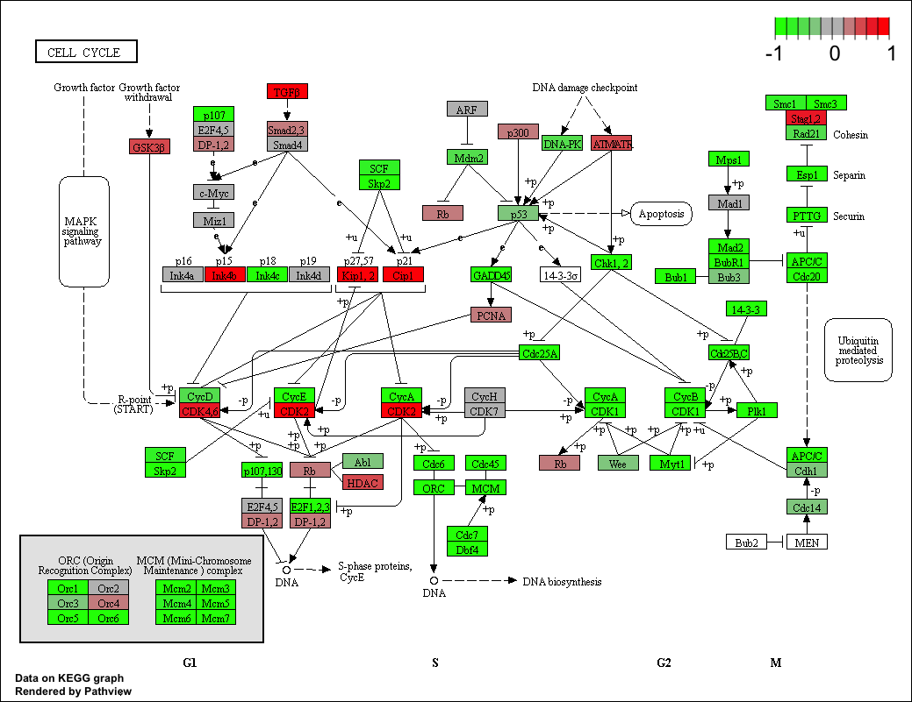

```{r setup, include=FALSE}
knitr::opts_chunk$set(echo = TRUE)
```

#The data for for hands-on session comes from GEO entry: GSE37704.
#The authors report on differential analysis of lung fibroblasts in response to loss of the developmental transcription factor HOXA1. Their results and others indicate that HOXA1 is required for lung fibroblast and HeLa cell cycle progression. In particular their analysis show that "loss of HOXA1 results in significant expression level changes in thousands of individual transcripts, along with isoform switching events in key regulators of the cell cycle". For our session we have used their Sailfish gene-level estimated counts and hence are restricted to protein-coding genes only.
```{r}
library(DESeq2)
```
#importing data

```{r}
metaFile <- "GSE37704_metadata.csv"
countFile <- "GSE37704_featurecounts.csv"
```


```{r}
colData = read.csv(metaFile, row.names=1)
head(colData)
```
```{r}
countData = read.csv(countFile, row.names=1)
head(countData)
```
#let's remove the first column
```{r}
countData <-countData[,-1]
```
#remove genes containing zeros
```{r}
countData<- countData [rowSums(countData) > 0, ]
```

```{r}
nrow(countData)
```
#Principal component analysis. the first step is usually to plot the data but here we have 15K genes. How do we plot this- PCA to the rescue!
```{r}
pc<- prcomp( t(countData))
plot(pc)
```
```{r}
summary(pc)
```
#PCA plot with colors do distinguish controls and knock downs.
```{r}
mycols<-c(rep("blue",3), rep ("red",3))
mycols
plot(pc$x[,1:2],col=mycols)
```
#if I want to see the significance I have to plot a volcano plot

```{r}
dds = DESeqDataSetFromMatrix(countData=countData,
                             colData=colData,
                             design=~condition)
dds = DESeq(dds)
```
```{r}
dds
```
```{r}
res = results(dds)
```
```{r}
res<-results(dds)
res
```
#volcano plot
```{r}
plot( res$log2FoldChange, -log(res$padj) )
```
```{r}
# Make a color vector for all genes
mycols <- rep("gray", nrow(res) )

# Color red the genes with absolute fold change above 2
mycols[ abs(res$log2FoldChange) > 2 ] <- "red"
```
```{r}
# Color blue those with adjusted p-value less than 0.01
#  and absolute fold change more than 2
inds <- (res$padj < 0.05) & (abs(res$log2FoldChange) > 2 )
mycols[ inds ] <- "blue"

plot( res$log2FoldChange, -log(res$padj), col=mycols, xlab="Log2(FoldChange)", ylab="-Log(P-value)" )
```


```{r}
library("AnnotationDbi")
library("org.Hs.eg.db")

columns(org.Hs.eg.db)
```

```{r}
res$symbol = mapIds (org.Hs.eg.db,
                    keys=row.names(res), #gene names
                    keytype="ENSEMBL", #format of your IDs
                    column="SYMBOL", #what  new IDs format you want?
                    multiVals="first")

res$entrez = mapIds(org.Hs.eg.db,
                    keys=row.names(res),
                    keytype="ENSEMBL",
                    column="ENTREZID",
                    multiVals="first")

res$name =   mapIds(org.Hs.eg.db,
                    keys=row.names(res),
                    keytype="ENSEMBL",
                    column="GENENAME",
                    multiVals="first")


```
```{r}
head(res, 10)
```
#PATHWAY ANALYSIS
```{r}
##BiocManager::install("c("pathview","gage","gageData")) if not already installed

library(pathview)

```
```{r}
library(gage)
```
```{r}
library(gageData)
```
```{r}
data(kegg.sets.hs)
data(sigmet.idx.hs)

```
```{r}

# Focus on signaling and metabolic pathways only
kegg.sets.hs = kegg.sets.hs[sigmet.idx.hs]

# Examine the first 3 pathways
head(kegg.sets.hs, 3)
```
#The main gage() function requires a named vector of fold changes, where the names of the values are the Entrez gene IDs.Note that we used the mapIDs() function above to obtain Entrez gene IDs (stored in res$entrez) and we have the fold change results from DESeq2 analysis (stored in res$log2FoldChange).
```{r}
foldchanges = res$log2FoldChange
names(foldchanges) = res$entrez
head(foldchanges)
```
#now let's ran the gage()function and get the results
```{r}
keggres=gage(foldchanges, gsets = kegg.sets.hs)
```
```{r}
attributes(keggres)
```
#let's look at the down regulated pathways

```{r}
head(keggres$less)
```
#Now, let's try out the pathview() function from the pathview package to make a pathway plot with our RNA-Seq expression results shown in color.To begin with lets manually supply a pathway.id (namely the first part of the "hsa04110 Cell cycle") that we could see from the print out above.
```{r}
pathview(gene.data=foldchanges, pathway.id="hsa04110")
```
#




