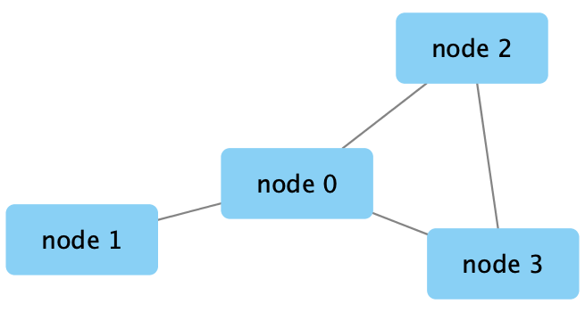
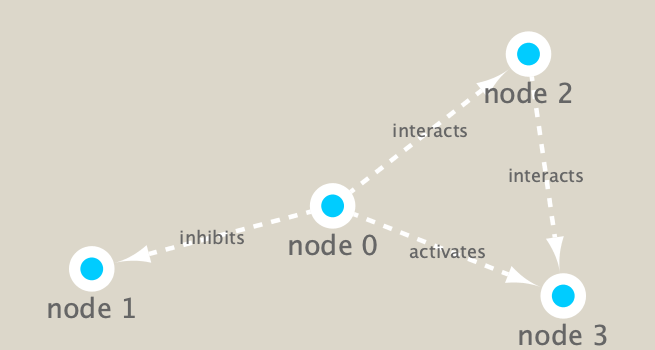

```{r setup, include=FALSE}
knitr::opts_chunk$set(echo = TRUE)
```

```{r}
library(RCy3)
```
```{r}
library(igraph)
```
```{r}
library(RColorBrewer)
```
```{r}
# Test the connection to Cytoscape.
cytoscapePing()
```
```{r}
# Check the version
cytoscapeVersionInfo()
```

```{r}
g <- makeSimpleIgraph()
createNetworkFromIgraph(g,"myGraph")
```
```{r}
fig <- exportImage(filename="demo", type="png", height=350)
```
```{r}

```
```{r}
#play with Cytoscape stiles
setVisualStyle("Marquee")
```
```{r}
fig <- exportImage(filename="demo_marquee", type="png", height=350)


```
```{r}
install.packages("readr")
```
```{r}
library(readr)
```


```{r, echo=FALSE}
class.file <- "https://bioboot.github.io/bimm143_S18/class-material/virus_prok_cor_abundant.tsv"
dir.create("data")
system("curl -O https://bioboot.github.io/bimm143_S18/class-material/virus_prok_cor_abundant.tsv data.")
#download.file(class.file, "data/virus_prok_cor_abundant.tsv")
```

```{r read-in-data}
## scripts for processing located in "inst/data-raw/"
prok_vir_cor <- read.delim("./data/virus_prok_cor_abundant.tsv", stringsAsFactors = FALSE)
## Have a peak at the first 6 rows
head(prok_vir_cor)
```
```

```

